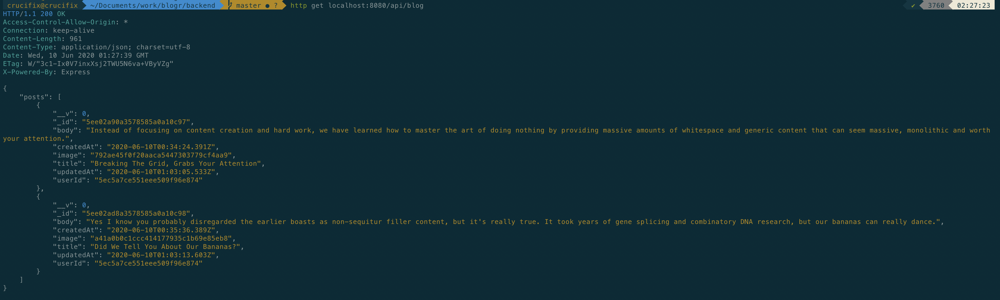

# Blogr Front End

A simple blogging application made with react and Semantic UI to demonstrate my knowledge of React (with Authentication support).

# Setup

Install `mongodb`. In root folder run `yarn`.
Rename `env-sample` to `.env` and change it to your liking.

## Installation

```
$ yarn install
$ yarn start
```

## Screenshots




